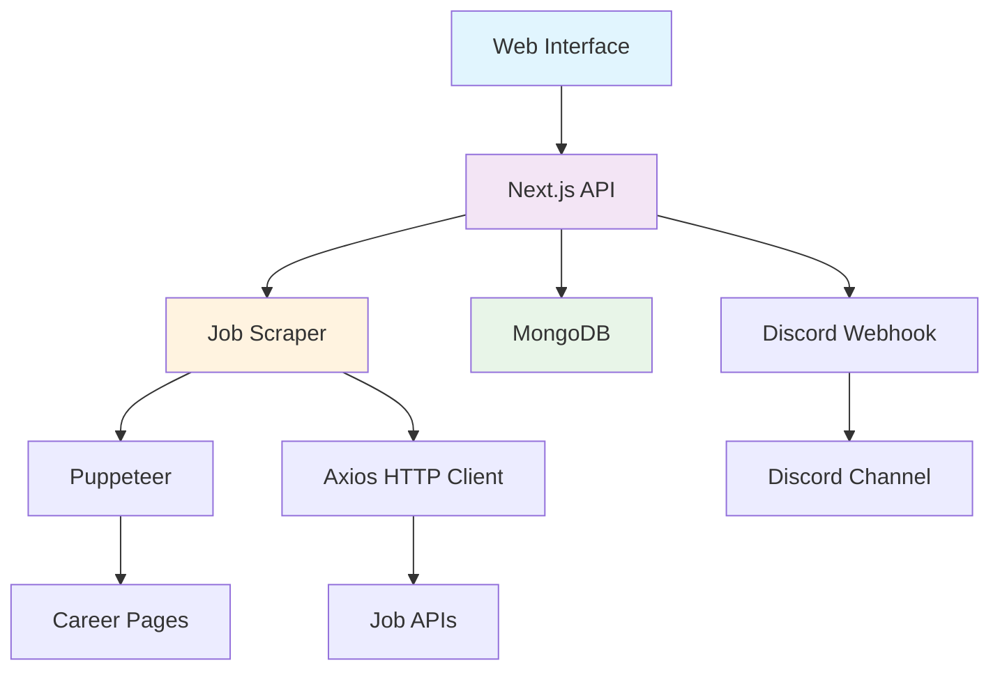

# 🚀 Job Alerts System

<div align="center">

[](https://nodejs.org/)
[](https://nextjs.org/)
[](https://mongodb.com/)
[](https://discord.com/)

*An intelligent job monitoring system that scrapes career pages and sends real-time alerts to Discord*

[Features](#-features) • [Installation](#-installation) • [Usage](#-usage) • [Configuration](#-configuration) • [API](#-api-reference)

</div>

---

## ✨ Features

<table>
<tr>
<td>

### 🔍 **Smart Job Scraping**
- Custom API endpoint configuration
- Dynamic query parameters & headers
- Puppeteer-powered web scraping
- Duplicate job detection

</td>
<td>

### 🎯 **Intelligent Filtering**
- Include/exclude keyword matching
- Location-based filtering
- Case-insensitive search
- Customizable constraints

</td>
</tr>
<tr>
<td>

### 📱 **Discord Integration**
- Rich embed notifications
- Real-time job alerts
- Webhook support
- Beautiful formatting

</td>
<td>

### 💾 **Data Management**
- MongoDB integration
- Job tracking & history
- Company management
- Duplicate prevention

</td>
</tr>
</table>

---

## 🚀 Quick Start

### Prerequisites

```bash
Node.js 18+ 
MongoDB 4.4+
Discord Webhook URL
```

### Installation

1. **Clone the repository**
   ```bash
   git clone https://github.com/harsh-chandak/job-alerts.git
   cd job-alerts
   ```

2. **Install dependencies**
   ```bash
   npm install
   ```

3. **Set up environment variables**
   ```bash
   cp .env.example .env
   ```
   
   Configure your `.env` file:
   ```env
   MONGODB_URI=mongodb://localhost:27017/job-alerts
   DISCORD_WEBHOOK_URL=https://discord.com/api/webhooks/your-webhook-url
   PORT=3000
   ```

4. **Run the application**
   ```bash
   npm run dev     # Development
   npm run build   # Production build
   npm start       # Production
   ```

---

## 🎮 Usage

### 1. Configure Companies

Navigate to the admin panel and add companies with their career page URLs:

```javascript
{
  "name": "TechCorp",
  "careersUrl": "https://techcorp.com/careers",
  "careersApi": "https://api.techcorp.com/jobs",
  "params": [
    { "key": "department", "value": "engineering", "enabled": true }
  ],
  "headers": [
    { "key": "Authorization", "value": "Bearer token", "enabled": true }
  ]
}
```

### 2. Set Job Constraints

Define your filtering criteria:

```javascript
const constraints = {
  include: ['intern', 'software', 'developer', 'engineering'],
  location: ['remote', 'united states', 'usa'],
  exclude: ['senior', 'director', 'citizen']
};
```

### 3. Monitor Jobs

The system automatically:
- 🔄 Scrapes configured career pages
- 🎯 Filters jobs based on constraints
- 📤 Sends Discord notifications for new matches
- 💾 Tracks sent jobs to prevent duplicates

---

## ⚙️ Configuration

### Job Filtering

<details>
<summary><strong>📋 Constraint Configuration</strong></summary>

```javascript
const constraints = {
  // Jobs must contain at least one of these keywords
  include: [
    'intern', 'internship', 'co-op',
    'software', 'developer', 'engineering',
    'data', 'engineer', 'frontend', 'backend'
  ],
  
  // Jobs must mention one of these locations
  location: [
    'remote', 'united states', 'usa',
    'new york', 'california', 'texas'
  ],
  
  // Jobs containing these keywords will be excluded
  exclude: [
    'senior', 'sr', 'director', 'manager',
    'citizen', 'clearance', 'lead'
  ]
};
```

</details>

### Discord Webhooks

<details>
<summary><strong>🤖 Discord Setup Guide</strong></summary>

1. Go to your Discord server settings
2. Navigate to **Integrations** → **Webhooks**
3. Click **Create Webhook**
4. Copy the webhook URL
5. Add it to your `.env` file

The system sends rich embeds with job details:
- 🎯 Job title and company
- 🆔 Unique job ID
- 📅 Posted date
- 🔗 Apply link

</details>

---

## 🔧 API Reference

### Companies Management

<details>
<summary><strong>GET /api/companies</strong></summary>

Get all configured companies.

**Response:**
```json
{
  "success": true,
  "companies": [
    {
      "_id": "company_id",
      "name": "TechCorp",
      "careersUrl": "https://techcorp.com/careers",
      "params": [...],
      "headers": [...]
    }
  ]
}
```

</details>

<details>
<summary><strong>POST /api/companies</strong></summary>

Add a new company configuration.

**Request Body:**
```json
{
  "name": "TechCorp",
  "careersUrl": "https://techcorp.com/careers",
  "careersApi": "https://api.techcorp.com/jobs",
  "params": [
    { "key": "type", "value": "full-time", "enabled": true }
  ],
  "headers": [
    { "key": "User-Agent", "value": "JobBot/1.0", "enabled": true }
  ]
}
```

</details>

### Job Monitoring

<details>
<summary><strong>POST /api/scrape</strong></summary>

Manually trigger job scraping for all companies.

**Response:**
```json
{
  "success": true,
  "jobsFound": 15,
  "newJobs": 3,
  "message": "Found 3 new jobs matching criteria"
}
```

</details>

---

## 🏗️ Architecture



---

## 🛠️ Development

### Project Structure

```
job-alerts/
├── 📁 public/ # Static assets like icons, logos, and SVGs
│
├── 📁 src/ # Source code
│ ├── 📁 app/ # App directory for components
│ │ └── 📁 components/ # Shared UI and logic components
│ │ ├── 📁 ui/ # Atomic UI components
│ │ │ ├── button.js # Reusable button component
│ │ │ ├── card.js # Card layout component
│ │ │ ├── input.js # Text input component
│ │ │ ├── label.js # Label for form fields
│ │ │ ├── textarea.js # Multi-line text input
│ │ ├── DraggableJsonField.js # JSON drag-and-drop configuration UI //Future Development
│ │ └── MappingDropZone.js # Mapping UI for matching fields visually
│
│ └── 📁 pages/ # Next.js pages and API routes
│ ├── 📁 api/ # API endpoints for server-side logic
│ │ ├── 📁 [userSlug]/ # Dynamic user-specific endpoints
│ │ │ ├── approve.js # Approve user logic
│ │ │ └── scrape.js # Scraping trigger by user
│ │ ├── 📁 auth/ # Auth-related APIs
│ │ │ ├── forgot.js # Request password reset
│ │ │ ├── forgot-pass-reset.js # Reset password with token
│ │ │ ├── login.js # User login
│ │ │ ├── profile.js # Get/update user profile
│ │ │ ├── register.js # User registration
│ │ │ ├── reset-password.js # Password reset confirmation
│ │ │ └── update-profile.js # Update profile fields
│ │ ├── 📁 companies/
│ │ │ ├── delete/ # Delete company config
│ │ │ │ └── [id].js # Delete company by ID
│ │ │ └── view/ # View individual company details
│ │ │ └── [id].js # Get company by ID
│ │ ├── 📁 jobs/ # Job-related operations
│ │ │ ├── get-all.js # Get all jobs in DB
│ │ │ ├── check-method.js # Check fetch method for a job
│ │ │ ├── fetchCompanyApi.js # Generic fetcher for external job APIs
│ │ │ ├── scrape.js # Scrape job postings
│ │ │ ├── try-puppeteer.js # Puppeteer test handler
│ │ │ └── upload.js # Upload jobs from CSV or form
│
│ ├── _app.js # App wrapper (global config and styles)
│ ├── alerts.js # Alerts dashboard
│ ├── companies.js # Company management UI
│ ├── forgot.js # Forgot password page
│ ├── home.js # Home / welcome page
│ ├── index.js # Redirect or main route
│ ├── register.js # Register form
│ └── settings.js # User settings page
│
├── 📁 styles/
│ └── globals.css # Global stylesheet
│
├── 📁 utils/ # Utility scripts and helpers
│ ├── 📁 server/
│ │ ├── auth.js # Server-side auth functions
│ │ ├── db.js # MongoDB connection logic
│ │ └── notify-new-user.js # Notify Discord on new user creation
│ ├── analyzePage.js # Analyze HTML page content
│ ├── discordHelper.js # Discord message formatting
│ ├── dynamicApiScraper.js # Smart scraping based on API schema
│ ├── failure-notify.js # Notify on failure conditions
│ ├── flattenJson.js # Flatten nested job listings
│ ├── scrapper.js # Core scraper logic
│ └── slugify.js # Converts strings to slugs
│
├── .env # Environment variable definitions
├── .gitignore # Git ignore rules
├── jsconfig.json # JS module path aliasing
├── next.config.mjs # Next.js config (custom headers, rewrites)
├── package.json # Project metadata and dependencies
├── package-lock.json # Exact dependency versions
└── README.md # Project documentation
```

### Adding New Features

To add new functionality to the job alerts system:

1. **API Endpoints**: Add new routes in `src/pages/api/`
   ```javascript
   // src/pages/api/companies.js
   export default async function handler(req, res) {
     // Your API logic here
   }
   ```

2. **UI Components**: Create reusable components in `src/app/components/ui/`
   ```javascript
   // src/app/components/ui/jobCard.js
   export function JobCard({ job }) {
     return <div>{job.title}</div>;
   }
   ```

3. **Utilities**: Add helper functions in `utils/`
   ```javascript
   // utils/jobFilters.js
   export function filterJobs(jobs, constraints) {
     // Filter logic
   }
   ```

---

## 🤝 Contributing

Contributions are welcome! Please feel free to submit a Pull Request.

### Development Setup

1. Fork the repository
2. Create your feature branch (`git checkout -b feature/AmazingFeature`)
3. Commit your changes (`git commit -m 'Add some AmazingFeature'`)
4. Push to the branch (`git push origin feature/AmazingFeature`)
5. Open a Pull Request

### Code Style

- Use ESLint and Prettier for code formatting
- Follow conventional commit messages
- Add tests for new features
- Update documentation as needed

---


## 🙏 Acknowledgments

- [Puppeteer](https://pptr.dev/) for web scraping capabilities
- [Next.js](https://nextjs.org/) for the fantastic React framework
- [MongoDB](https://www.mongodb.com/) for reliable data storage
- [Discord](https://discord.com/) for webhook notifications

---

<div align="center">

**[⬆ Back to Top](#-job-alerts-system)**

Made with ❤️ by [Harsh Chandak](https://github.com/harsh-chandak)

*Star ⭐ this repo if you find it helpful!*

</div>